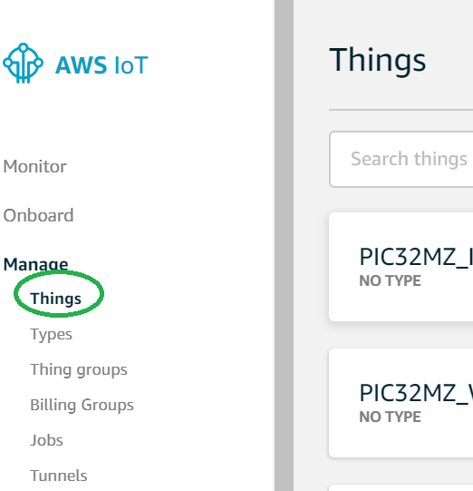
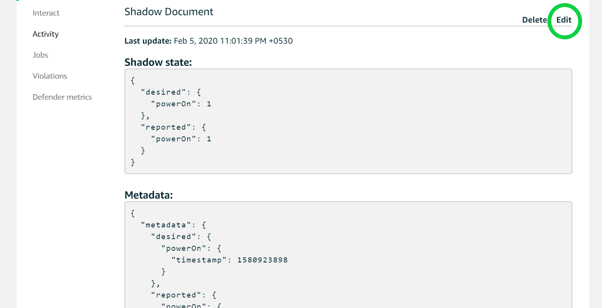
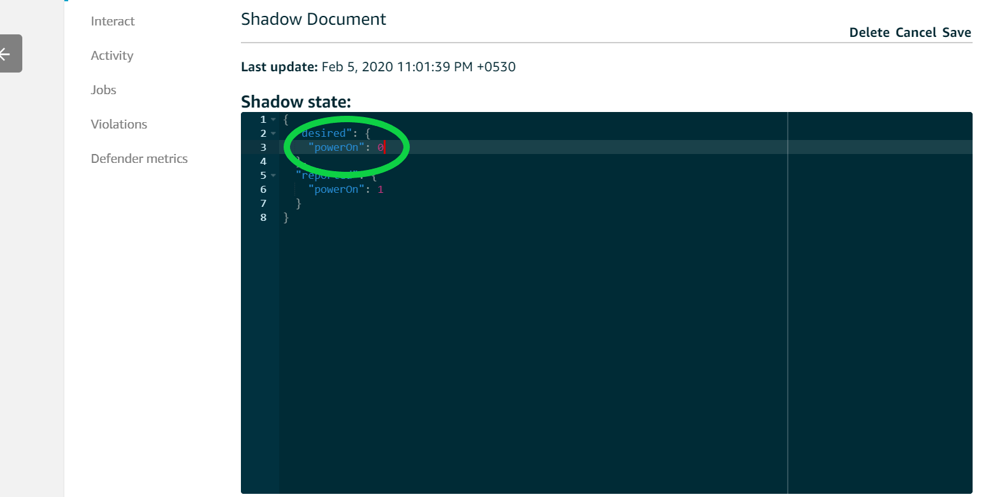

# Building and Running on PIC32MZEF Curiosity 2.0 (Wired)

## Downloading and building the application

To clone or download this application from Github,go to the [main page of this repository](https://github.com/Microchip-MPLAB-Harmony/aws_cloud) and then click Clone button to clone this repo or download as zip file. This content can also be download using content manager by following [these instructions](https://github.com/Microchip-MPLAB-Harmony/contentmanager/wiki)

Path of the application within the repository is **apps/led_shadow_client_ecc/**

To build the application, refer to the following table and open the project using its IDE.

### LED Shadow Client Demo Application

| Project Name      | Description                                    |
| ----------------- | ---------------------------------------------- |
| firmware/pic32mz_ef_curiosity_v2.X    | MPLABX Project for [PIC32MZEF Curiosity 2.0 board](https://www.microchip.com/developmenttools/ProductDetails/DM320209)|

## Provisoning the device for AWS account access.

- Refer to [Getting Started guide](https://github.com/MicrochipTech/amazon-freertos/blob/mchpdev/vendors/microchip/boards/GettingStarted_With%20PIC32MZEF.md) for setting up the AWS account based on your hardware configuration.
- With the completion of the above steps, the user would have got aws_clientcredential.h and aws_clientcredentialkeys.h, this may be used for running the demos.

## Setting up [PIC32MZEF Curiosity 2.0 board](https://www.microchip.com/developmenttools/ProductDetails/DM320209)

- Connect the Debug USB port on the board to the computer using a micro USB cable
- Connect the ATECC608A Trust on the mikroBUS Xplained Pro adapter in EXT2.
- Connect the LAN8720PHY daughter card in the PHY slot.

## Building the Application

1. Open the application project *firmware/pic32mz_ef_curiosity_v2.X* in the IDE
2. Use the aws_clientcredential.h and aws_clientcredentialkeys.h obtained from provisoning the device to aws account.
3. Build and program the application using the IDE

## Running the Application
1. Connect an ethernet cable from an internet router to the PHY slot in PIC32MZEF Curiosity 2.0 board.
2. If above step is successful then the **LED0** on the board would turn ON/OFF once.
3. Open the Terminal application (Ex.:Tera Term) on the computer
4. Configure the serial port settings as follows:
    - Baud : 115200
    - Data : 8 Bits
    - Parity : None
    - Stop : 1 Bit
    - Flow Control : None

5. Login to your AWS amazon account 
From the Services menu (upper left), click (or search for) IoT Core and open it. This will open the Aws IoT page as shown below.

6. From the menu on the left, Click "Manage" and then Click "Things". This will display all the things managed by your AWS account in the right pane.
In the right pane, click the "Things" item, which represents your device. 

7. The THING Name and Shadow ARN are masked for security reasons. Click on the "Shadow" item in the right pane. This will display the device shadow page. 

8. Build and Program the application using the MPLAB X IDE. The device will toggle one LED and now a shadow document will be created in the Device's Shadow page. 
The Shadow state document is JSON formatted file representing the device's state, in this example the LED status is depicated as device's status.

9. The JSON variable "powerOn" indicates the LED state of the board and Shadow state depicts the current state of the device.

10. The user can modify the Shadow state till the connection is alive by click on the Edit button in the Shadow Document and changing the "powerOn" state. 

11. Change the power On value to '1' and click on the Save Button, this will turn LED0 "ON". Changing the value to 0 will turn LED0 off. Similarly it
follows below truth table.

| S.No | LED2| LED1 | LED0 | powerOn (Value) | Remarks |
| --- | --- | --- | --- | --- | --- |
| 1 | OFF | OFF | OFF | 0 | All LED off. |
| 2. | OFF | OFF | ON | 1 | LED0 On. |
| 3. | OFF | ON | OFF | 2 | LED1  On. |
| 4. | OFF | ON | ON | 3 | LED0 and LED1 On. |
| 5 | ON | OFF | OFF | 4 | LED2 ON. |
| 6. | ON | OFF | ON | 5 | LED0 and LED2 ON |
| 7 | ON | ON | OFF | 6 | LED1 and LED2 ON |
| 8 | ON | ON | ON | 7 | LED 0, LED 1 and LED 2 ON.|
