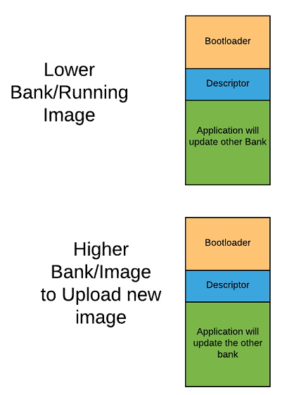
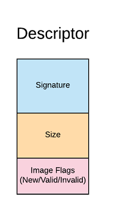
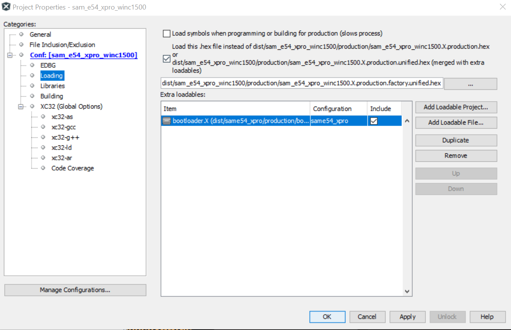

# Building and Running on SAM E54 Xplained Pro Evaluation Kit + WINC1500

## Downloading and building the application

To clone or download this application from Github,go to the [main page of this repository](https://github.com/Microchip-MPLAB-Harmony/aws_cloud) and then click Clone button to clone this repo or download as zip file. This content can also be download using content manager by following [these instructions](https://github.com/Microchip-MPLAB-Harmony/contentmanager/wiki)

Path of the application within the repository is **apps/ota_update_demo/**

To build the application, refer to the following table and open the project using its IDE.

### OTA Update Demo Application

| Project Name      | Description                                    |
| ----------------- | ---------------------------------------------- |
| firmware/sam_e54_xpro_winc1500.X    | MPLABX Project for [SAM E54 Xplained Pro Evaluation Kit](https://www.microchip.com/developmenttools/ProductDetails/atsame54-xpro)|

## Brief Introduction on OTA Update

Note: OTA Guide on FreeRTOS can be found [here](https://github.com/MicrochipTech/amazon-freertos/blob/mchpdev/vendors/microchip/boards/OTAGuideForSAME54.md) for setting up and running the demo

The FreeRTOS OTA Solution requires a code-signing certificate with an ECDSA P-256 key and SHA-256 hash to perform OTA updates. 

Any image, which needs to be programmed needs to be signed by the private key generated using above step.
The signed image is verified by the code signing certficate present in the hardware. FreeRTOS OTA also requires dual bank support of
storing the running image and the new image to be flashed in different banks, so that at any point of time there is one valid
image available.

As part of the above step, we import the code-signing certificate, private key, and certificate chain into AWS Certificate Manager. 
This ensures the FreeRTOS OTA Job to sign the firmware image used in Amazon S3 buckets with the private key.

    

- The bootloader is a Fail-Safe secure bootloader, which verfies the Application image stored in the each bank with the ECDSA/SHA-256 signature stored in the bank's descriptor.
The bootloader uses the code signing certficate generated earlier and stored in th flash.
- The Application image is a FreeRTOS based application which uses FreeRTOS OTA to perform a live firmware update into the higher bank.
- The Descriptor maintains the status of the Application image stored (i.e. image flags, image signature, size,etc).

Note: The initial image that needs to be programmed is a factory image. The factory Application image needs to be signed by the OEM for the first time, following
which users needs to upload unsigned firmware image into Amazon S3 buckets and follow the [FreeRTOS OTA guide](https://github.com/MicrochipTech/amazon-freertos/blob/mchpdev/vendors/microchip/boards/OTAGuideForSAME54.md) to perform
OTA Update.

## Provisoning the device for AWS account access.

- Refer to [Getting Started guide](https://github.com/MicrochipTech/amazon-freertos/blob/mchpdev/vendors/microchip/boards/GettingStarted_With%20SAME54.md) for setting up the AWS account based on your hardware configuration.
- With the completion of the above steps, the user would have got aws_clientcredential.h and aws_clientcredentialkeys.h, this would be used for running the demos.
- Place the code signer certificate in PEM format under demos\include\aws_ota_codesigner_certificate.h (You can use the utility in amazon-freertos\tools\certificate_configuration\PEMfileToCString.html).

## Pre-Requisite for running this demo

## Setting up [SAM E54 Xplained Pro Evaluation Kit](https://www.microchip.com/developmenttools/ProductDetails/atsame54-xpro)

- Connect the Debug USB port on the board to the computer using a micro USB cable
- Connect the ATECC608A Trust on the mikroBUS Xplained Pro adapter in EXT2.
- Connect the WINC1500 Xplained Pro in EXT1
- Refer to [OTA guide](https://github.com/MicrochipTech/amazon-freertos/blob/mchpdev/vendors/microchip/boards/OTAGuideForSAME54.md) for setting up OTA accounts if not done already.

## Install the initial version of firmware on the Microchip SAME54-XPRO

## Building the Application

1. Add the bootloader project available as a loadable project from [here](https://github.com/MicrochipTech/amazon-freertos/tree/mchpdev/projects/microchip/same54_xpro/mplab/bootloader/firmware).
2. Open the application project *firmware/sam_e54_xpro_winc1500.X* in the IDE
3. Use the aws_clientcredential.h, aws_clientcredentialkeys.h and aws_ota_codesigner_certificate.h obtained from provisoning the device to aws account.
4. Building the application would generate an unsigned unified image of Bootloader/Application.
5. The Bootloader would generate aws_boot_codesigner_public_key.h as pre-built setup,ensure your code signer certificate had been placed . 

## Programming the Signed Factory Image

1. Make sure you have the [SRecord](https://sourceforge.net/projects/srecord/) tools installed from Source Forge. Verify that the directory that contains the srec_cat and srec_info programs is in your system path.
2. Make sure you have python3 installed and verify python3 path is set in system path. 
3. Run the below command from ota_update_demo\firmware\sam_e54_xpro_winc1500.X folder
	"python ../../../../../amazon-freertos/vendors/microchip/boards/same54_xpro/bootloader/bootloader/utility/factory_image_generator.py -b "dist/sam_e54_xpro_winc1500/production/sam_e54_xpro_winc1500.X.production.bin" -p MCHP-Curiosity-PIC32MZEF -k ../../../../../amazon-freertos/vendors/microchip/boards/same54_xpro/bootloader/bootloader/utility/codesigner_cert_utility/ecdsasigner.key -x  ../../../../../amazon-freertos/vendors/microchip/boards/same54_xpro/bootloader/bootloader/utility/bootloader.X.production.hex"
4. This will create a signed unified hex file "sam_e54_xpro_winc1500.X.production.factory.unified.hex"	

5. Add this signed image as the image to be programmed from MPLAB IDE

## Running the Application
1. Ensure Wifi router is connected to internet before turning on the board. 
2. Open the Terminal application (Ex.:Tera Term) on the computer
3. Configure the serial port settings as follows:
    - Baud : 115200
    - Data : 8 Bits
    - Parity : None
    - Stop : 1 Bit
    - Flow Control : None
4. Follow the steps mentioned here to update the application version with an increased build number (say 3) in this project [Version Update](https://github.com/MicrochipTech/amazon-freertos/blob/mchpdev/vendors/microchip/boards/OTAGuideForSAME54.md#update-the-version-of-your-%EF%AC%81rmware).
5. Follow the steps mentioned here to perform an [OTA Update](https://github.com/MicrochipTech/amazon-freertos/blob/mchpdev/vendors/microchip/boards/OTAGuideForSAME54.md#creating-an-ota-update-aws-iot-console).
6. The steps mentioned above will perform an OTA update and the new application will be programmed, this would cause an LED update.
