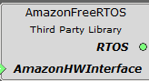
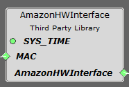
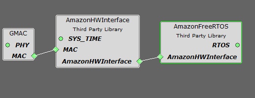
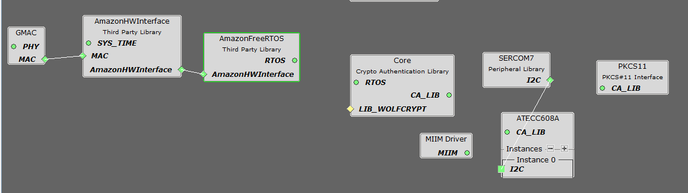
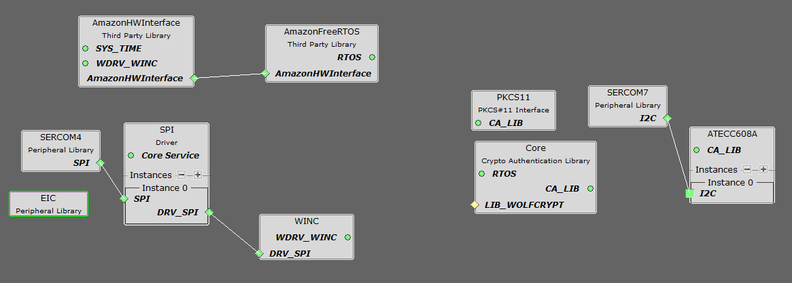

---
title: AWS Cloud Component and Applications
has_children: true
has_toc: false
nav_order: 1
---


# MPLAB® Harmony 3 Configurations and Applications to securely connect IoT devices to the AWS cloud using FreeRTOS.

MPLAB® Harmony 3 is an extension of the MPLAB® ecosystem for creating
embedded firmware solutions for Microchip 32-bit SAM and PIC® microcontroller
and microprocessor devices.  Refer to the following links for more information.

- [Microchip 32-bit MCUs](https://www.microchip.com/design-centers/32-bit)
- [Microchip 32-bit MPUs](https://www.microchip.com/design-centers/32-bit-mpus)
- [Microchip MPLAB X IDE](https://www.microchip.com/mplab/mplab-x-ide)
- [Microchip MPLAB® Harmony](https://www.microchip.com/mplab/mplab-harmony)
- [Microchip MPLAB® Harmony Pages](https://microchip-mplab-harmony.github.io/)

This repository contains the MPLAB® Harmony 3 AWS Cloud application examples

- [Release Notes](release_notes.md)
- [MPLAB® Harmony License](mplab_harmony_license.md)

# Contents Summary

| Folder    | Description                                                |
|-----------|------------------------------------------------------------|
| apps      | Example applications for FreeRTOS                   |
| config    | FreeRTOS module configuration scripts               |
| doc       | Image files           		         |
| docs      | FreeRTOS help documentation           		         |
| templates | Configurations file templates                              |


## Cloning AWS_Cloud repo

To clone or download the repo from Github,go to the main page of this repository and then click Clone button to clone this repo or download as zip file. This content can also be download using content manager by following these instructions

This repo contains scripts needed to represent [FreeRTOS](https://github.com/MicrochipTech/amazon-freertos) as Harmony 3 component. It requires [FreeRTOS](https://github.com/MicrochipTech/amazon-freertos) repository to be cloned for code generation.

## Cloning FreeRTOS.

To clone:
```
git clone https://github.com/MicrochipTech/amazon-freertos
```


# Getting Started

For more information on FreeRTOS and provisoning of secure element, refer to the [Getting Started guide of different boards](https://github.com/MicrochipTech/amazon-freertos/tree/mchpdev/vendors/microchip/boards).

## Introduction

The FreeRTOS is abstracted as Harmony 3 component to easily configure and generate code to develop cloud connected applications using Harmony 3 framework.
It uses updated version of FreeRTOS 202002.00 to support Microchip products for code generation.

Amazon FreeRTOS is now termed as FreeRTOS, but we still use the term Amazon FreeRTOS as the H3 component name to avoid confusion with 
existing H3 FreeRTOS (kernel) Component.

FreeRTOS is supported in the following products.

- SAM E70/S70/V70/V71 Family + + ECC608 (Optional) + WINC1500/WINC3400 (Optional)
- SAM D5x/E5x Family + ECC608 (Optional) + WINC1500/WINC3400 (Optional)
- PIC32MZ Embedded Connectivity with Floating Point Unit (EF) Family + ECC608 (Optional) + WINC1500/WINC3400 (Optional)
- SAM G55 Family + ECC608 + WINC1500/WINC3400.

This repository contains following three components for configuration and code generation.

## AmazonFreeRTOS Component 

Amazon FreeRTOS component is used to configure and generate FreeRTOS code, indepdent of any hardware configuration 



## AmazonHWInterface component 

The Hardware interface component is used to abstract device, interface and key storage configuration and code generation. 



There are three configurations supported by this component

1. Wired Solution Only.



This solution is available in all platforms which supports wired connectvity (except SAMG55).
2. Wired + ECC608 Solution 



This solution is available in all platforms which supports wired connectvity (except SAMG55).
3. WIFI Solution (WINC based solution can be WINC1500/WINC3400) 



This solution is available in all platforms supported..

## AmazonDeviceTester component 

Amazon DeviceTester component is used to configure and generate code for qualification testing. It adds required dependencies for testing the Amazon FreeRTOS solution using Amazon IDT (refer: https://docs.aws.amazon.com/freertos/latest/userguide/device-tester-for-freertos-ug.html). 

 

Important Licensing Information:
For FreeRTOS License, please refer to the license file in the [FreeRTOS](https://github.com/MicrochipTech/amazon-freertos/tree/mchpdev) repository. 


## AWS Cloud Examples

The following applications are provided to demonstrate the AWS Cloud H3 Component

| Name                                                                  | Description                                                        |
| --------                                                              | -----------                                                        |
| [LED Shadow Client](apps/led_shadow_client_ecc/readme.md)             | This example application shows how to use the Shadow client feature to set/clear device status using LED(s) using ECC608 |
| [OTA Update Demo](apps/ota_update_demo/readme.md)             		| This example application demonstrates the usage of OTA feature to update a new image on SAME54 XPRO + WINC1500. |


____

[](https://github.com/Microchip-MPLAB-Harmony/aws_cloud/blob/master/mplab_harmony_license.md)
[](https://github.com/Microchip-MPLAB-Harmony/aws_cloud/releases/latest)
[](https://github.com/Microchip-MPLAB-Harmony/aws_cloud/releases/latest)
[](https://github.com/Microchip-MPLAB-Harmony/aws_cloud/graphs/commit-activity)
[]()

____

[](https://www.youtube.com/user/MicrochipTechnology)
[](https://www.linkedin.com/company/microchip-technology)
[](https://www.facebook.com/microchiptechnology/)
[](https://twitter.com/MicrochipTech)

[]()
[]()


