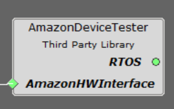

# MPLAB® Harmony 3 Configurations and Applications to securely connect IoT devices to the AWS cloud using Amazon FreeRTOS.

MPLAB® Harmony 3 is an extension of the MPLAB® ecosystem for creating
embedded firmware solutions for Microchip 32-bit SAM and PIC® microcontroller
and microprocessor devices.  Refer to the following links for more information.

- [Microchip 32-bit MCUs](https://www.microchip.com/design-centers/32-bit)
- [Microchip 32-bit MPUs](https://www.microchip.com/design-centers/32-bit-mpus)
- [Microchip MPLAB X IDE](https://www.microchip.com/mplab/mplab-x-ide)
- [Microchip MPLAB® Harmony](https://www.microchip.com/mplab/mplab-harmony)
- [Microchip MPLAB® Harmony Pages](https://microchip-mplab-harmony.github.io/)

This repository contains the MPLAB® Harmony 3 AWS Cloud application examples

- [Release Notes](release_notes.md)
- [MPLAB® Harmony License](mplab_harmony_license.md)

# Contents Summary

| Folder    | Description                                                |
|-----------|------------------------------------------------------------|
| apps      | Example applications for Amazon FreeRTOS                   |
| config    | Amazon FreeRTOS module configuration scripts               |
| doc       | Images for Amazon FreeRTOS Component documentation           		         |
| docs      | Amazon FreeRTOS help documentation           		         |
| templates | Configurations file templates                              |


## Cloning AWS_Cloud repo

To clone or download the repo from Github,go to the main page of this repository and then click Clone button to clone this repo or download as zip file. This content can also be download using content manager by following these instructions

This repo contains scripts needed to represent [amazon-freertos](https://github.com/MicrochipTech/amazon-freertos) as Harmony 3 component. It requires [amazon-freertos](https://github.com/MicrochipTech/amazon-freertos) repository to be cloned for code generation.

## Cloning FreeRTOS (amazon-freertos)

This repo uses [Git Submodules](https://git-scm.com/book/en/v2/Git-Tools-Submodules) to bring in dependent components.

Note: If you download the ZIP file provided by GitHub UI or using content-manager, you will not get the contents of the submodules. (The ZIP file is also not a valid git repository)

To clone:
```
git clone https://github.com/MicrochipTech/amazon-freertos --recurse-submodules
```

If you have downloaded the repo without using the `--recurse-submodules` argument, you need to run:
```
git submodule update --init --recursive
```

# Getting Started

For more information on FreeRTOS, refer to the [Getting Started guide of different boards](https://github.com/MicrochipTech/amazon-freertos/tree/mchpdev/vendors/microchip/boards).

# Contents Summary

| Folder    | Description                                                |
|-----------|------------------------------------------------------------|
| apps      | Example applications for Amazon FreeRTOS                   |
| config    | Amazon FreeRTOS module configuration scripts               |
| doc       | Images for Amazon FreeRTOS Component documentation           		         |
| docs      | Amazon FreeRTOS help documentation           		         |
| templates | Configurations file templates                              |


## Introduction

The Amazon FreeRTOS is abstracted as Harmony 3 component to easily configure and generate code to develop cloud connected applications using Harmony 3 framework.
It uses updated version of Amazon FreeRTOS 202002.00 to support Microchip products for code generation.

Amazon FreeRTOS is now termed as FreeRTOS, but we still use the term Amazon FreeRTOS as the H3 component name to avoid confusion with 
existing H3 FreeRTOS (kernel) Component.

The Amazon FreeRTOS is supported in the following products.

- SAM E70/S70/V70/V71 Family + ECC608 (Optional)
- SAM D5x/E5x Family + ECC608 (Optional) + WINC1500/WINC3400 (Optional)
- PIC32MZ Embedded Connectivity with Floating Point Unit (EF) Family + ECC608 (Optional)

This repository contains following three components for configuration and code generation.

##AmazonFreeRTOS Component 
Amazon FreeRTOS component is used to configure and generate Amazon FreeRTOS code, indepdent of any hardware configuration 


##AmazonHWInterface component 
The Hardware interface components is used for device specific (E5x/D5x/E70/S70/V70/V71/PIC32MZEF) and 
Hardware specific (Ethernet/WIFI, NVM/ECC608) configuration and harcode generation.


There are three configurations supported by this component

1. Wired Solution Only.


This solution is available in all platforms.
2. Wired + ECC608 Solution 


This solution is available in all platforms.
3. WIFI Solution (WINC based solution can be WINC1500/WINC3400) 


This solution is available in SAMD5x/E5x platform only.

#AmazonDeviceTester component 
Amazon DeviceTester component is used to configure and generate code for qualification testing. It adds required dependencies for testing the Amazon FreeRTOS solution using Amazon IDT (refer: https://docs.aws.amazon.com/freertos/latest/userguide/device-tester-for-freertos-ug.html). 

 

Important Licensing Information:
For Amazon-FreeRTOS License, please refer to the license file under the [amazon-freertos](https://github.com/MicrochipTech/amazon-freertos/tree/mchpdev) folder. 


## AWS Cloud Examples

The following applications are provided to demonstrate the AWS Cloud H3 Component

| Name                                                                  | Description                                                        |
| --------                                                              | -----------                                                        |
| [LED Shadow Client](apps/led_shadow_client_ecc/readme.md)             | This example application shows how to use the Shadow client feature to set/clear device status using LED(s) using ECC608 |


____

[](https://github.com/Microchip-MPLAB-Harmony/aws_cloud/blob/master/mplab_harmony_license.md)
[](https://github.com/Microchip-MPLAB-Harmony/aws_cloud/releases/latest)
[](https://github.com/Microchip-MPLAB-Harmony/aws_cloud/releases/latest)
[](https://github.com/Microchip-MPLAB-Harmony/aws_cloud/graphs/commit-activity)
[]()

____

[](https://www.youtube.com/user/MicrochipTechnology)
[](https://www.linkedin.com/company/microchip-technology)
[](https://www.facebook.com/microchiptechnology/)
[](https://twitter.com/MicrochipTech)

[]()
[]()


